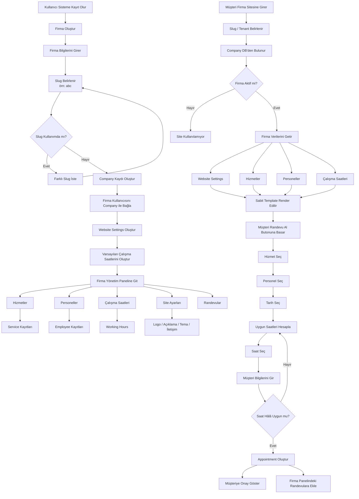

# Multi-Tenant Randevu Sistemi – Uygulama Akışı

> Bu doküman yalnızca uygulama ve veritabanı tarafındaki yapıyı anlatır. Sunucu, Nginx, DNS ve domain işlemleri kapsam dışıdır.

## 1. Genel Akış



---

## 2. Sistemin Merkezi: Company / Tenant

```text
                    USER
                     │
                     ▼
              ┌──────────────┐
              │   COMPANY    │
              │   tenant     │
              └──────┬───────┘
                     │
        ┌────────────┼──────────────┐
        │            │              │
        ▼            ▼              ▼
   Employees      Services    WebsiteSettings
        │            │              │
        └──────┬─────┘              │
               │                    │
               ▼                    ▼
        WorkingHours          Sabit Template
               │                    │
               │                    ▼
               │              Firma Web Sitesi
               │                    │
               └─────────┬──────────┘
                         ▼
                    Appointment
                         │
                  ┌──────┴──────┐
                  ▼             ▼
               Customer       Company
```

Her firma sistemde bir `Company` kaydıdır. Firma ile ilişkili bütün kayıtlar `company_id` üzerinden ayrılır.

---

## 3. Firma Kayıt Akışı

```text
1. Kullanıcı kayıt olur
        ↓
2. Firma oluştur ekranı
        ↓
3. Firma bilgilerini girer
   - Firma adı
   - Telefon
   - E-posta
   - Slug
        ↓
4. Slug kontrolü
        ↓
5. Company oluştur
        ↓
6. Kullanıcıyı Company'ye bağla
        ↓
7. WebsiteSettings oluştur
        ↓
8. Varsayılan çalışma saatlerini oluştur
        ↓
9. Yönetim paneline yönlendir
```

### Örnek kayıtlar

```text
User
----------------
id: 10
name: Ahmet


Company
----------------
id: 25
name: ABC Kuaför
slug: abc
isActive: true


CompanyUser
----------------
userId: 10
companyId: 25
role: OWNER
```

---

## 4. Firma Yönetim Paneli

```text
Dashboard
│
├── Randevular
│
├── Takvim
│
├── Hizmetler
│
├── Personeller
│
├── Müşteriler
│
├── Çalışma Saatleri
│
└── Web Sitesi
      │
      ├── Logo
      ├── Kapak
      ├── Başlık
      ├── Hakkımızda
      ├── Telefon
      ├── Adres
      ├── Sosyal Medya
      └── Tema
```

Web sitesi için ayrıca HTML dosyası üretmeye gerek yoktur. Firma oluşturulduğu anda `Company` ve `WebsiteSettings` kayıtları sayesinde site hazır kabul edilir.

---

## 5. Firma Sitesi Açıldığında

```text
Firma sitesi isteği
        ↓
Tenant / Slug bulunur
        ↓
Company getir
        ↓
company.isActive kontrol et
        ↓
WebsiteSettings getir
        ↓
Services getir
        ↓
Employees getir
        ↓
WorkingHours getir
        ↓
Hepsini tek modele dönüştür
        ↓
Sabit Template'e ver
        ↓
Firma sitesi göster
```

### Template'e gönderilebilecek örnek veri

```json
{
  "company": {
    "id": 25,
    "name": "ABC Kuaför",
    "slug": "abc",
    "phone": "..."
  },
  "website": {
    "title": "ABC Kuaför",
    "description": "Profesyonel saç bakım hizmetleri",
    "logo": "...",
    "theme": "default"
  },
  "services": [
    {
      "id": 1,
      "name": "Saç Kesimi",
      "duration": 45,
      "price": 500
    }
  ],
  "employees": [
    {
      "id": 4,
      "name": "Mehmet"
    }
  ]
}
```

Template sabit kalır; yalnızca veri değişir.

```text
ABC verisi
     ↓
┌─────────────────────────┐
│                         │
│     SABİT TEMPLATE      │
│                         │
│ Logo                    │
│ Firma adı               │
│ Hizmetler               │
│ Personeller             │
│ Hakkımızda              │
│ Randevu Al              │
│                         │
└─────────────────────────┘
```

Başka bir firma için aynı template farklı verilerle render edilir.

---

## 6. Randevu Alma Akışı

```text
Firma
 ↓
Hizmet seç
 ↓
Bu hizmeti veren personelleri getir
 ↓
Personel seç
 ↓
Tarih seç
 ↓
Personelin çalışma saatlerini getir
 ↓
İzin / mola / mevcut randevuları çıkar
 ↓
Hizmet süresine göre uygun slotları hesapla
 ↓
Saat seç
 ↓
Ad / Soyad / Telefon
 ↓
Son kez uygunluk kontrolü
 ↓
Appointment oluştur
 ↓
Başarılı
```

### Örnek uygun saat hesabı

```text
Çalışma:
09:00 ───────────────────── 18:00

Mevcut randevu:
          11:00 ── 12:00

Mola:
                       14:00 ─ 14:30

Hizmet süresi:
45 dakika

             ↓

Uygun slotlar:

09:00
09:45
10:30
12:00
12:45
...
```

Randevu kaydedilmeden hemen önce uygunluk tekrar kontrol edilmelidir.

```text
Müşteri A → 14:00 seçti
Müşteri B → 14:00 seçti

        ↓

Backend transaction

        ↓

İlk gelen → Randevu oluşturuldu
İkinci gelen → Bu saat artık dolu
```

---

## 7. Önerilen Veritabanı İlişkileri

```text
Company
│
├── CompanyUser
│
├── WebsiteSettings
│
├── Employee
│     │
│     ├── EmployeeService
│     ├── WorkingHours
│     └── TimeOff
│
├── Service
│
├── Customer
│
└── Appointment
      │
      ├── Service
      ├── Employee
      └── Customer
```

### Temel tablolar

```text
companies
company_users
website_settings

employees
services
employee_services

working_hours
time_off

customers
appointments
```

Çok kiracılı yapıyı korumak için ilgili tablolarda mümkün olduğunca `company_id` kullanılmalıdır.

### Appointment örneği

```text
appointments
--------------------------------
id
company_id
customer_id
employee_id
service_id
start_at
end_at
status
created_at
```

---

## 8. Tenant İzolasyonu

Sistemin temel kuralı:

```text
              COMPANY
                 │
        ┌────────┼─────────┐
        ▼        ▼         ▼
      Site    Yönetim   Randevu
        │       Paneli     Sistemi
        │        │          │
        └────────┴──────────┘
                 │
                 ▼
              company_id
```

Örneğin randevu sorgusunda yalnızca `id` ile sorgulamak yerine `company_id` ile birlikte sorgulamak gerekir.

Yanlış:

```sql
SELECT *
FROM appointments
WHERE id = 123;
```

Doğru yaklaşım:

```sql
SELECT *
FROM appointments
WHERE id = 123
  AND company_id = 25;
```

Bu yaklaşım firmaların birbirlerinin verilerine erişmesini engellemek için önemlidir.

---

## 9. Geliştirme Sırası

```text
1. User / Authentication
          ↓
2. Company / Tenant sistemi
          ↓
3. Firma kullanıcıları ve roller
          ↓
4. Services
          ↓
5. Employees
          ↓
6. Employee ↔ Service ilişkisi
          ↓
7. Working Hours
          ↓
8. Appointment sistemi
          ↓
9. Customer sistemi
          ↓
10. WebsiteSettings
          ↓
11. Public sabit template
          ↓
12. Tenant'a göre template doldurma
          ↓
13. Bildirimler
          ↓
14. Ödeme / abonelik
```

## 10. Önerilen Öncelik

İlk önce şu çekirdeği tamamlamak en sağlıklı yaklaşımdır:

```text
Company
   ↓
Service
   ↓
Employee
   ↓
WorkingHours
   ↓
Appointment
```

Public firma web sitesi daha sonra bu çekirdeğin üzerine eklenebilir.

Temel prensip:

```text
Tek uygulama
+
Tek sabit template
+
Tenant / Company bazlı veri
=
Her firma için dinamik web sitesi
```
